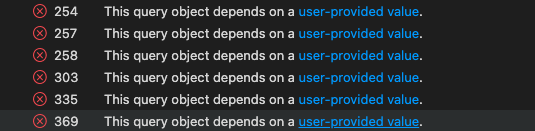

# Fake Stack Overflow Application

## Installation and Running the Application with Docker

### Prerequisites

Ensure you have Docker and Docker Compose installed on your machine to run containerized applications.

-   Install Docker
-   Install Docker Compose

### Steps to Run the Application

1.  **Clone the repository**

```git clone https://github.com/CSE-316-Software-Development/web-dev-final-project-aditya-sudhanva.git```
```cd web-dev-final-project-aditya-sudhanva```

3.  **Build the Docker images** This command builds the Docker images for the `client`, `server`, and `mongodb` services as defined in your `docker-compose.yml` file.
    
    
    `docker-compose build` 
    
4.  **Run the Docker containers** Start all services (`client`, `server`, and `mongodb`) defined in the Docker Compose file. These commands will also establish the necessary networks and mount the defined volumes.
    
    `docker-compose up -d` 
    
    The `-d` flag runs the containers in the background, allowing you to continue using the terminal.
    
5.  **Verify the application is running** Check the status of the containers to ensure they are up and functioning correctly:
    
    `docker-compose ps` 
    
    This command lists all the running containers along with their status. Verify that there are no errors and all services are running.
    
6.  **Access the application**
    
    -   Access the **client** application at `http://localhost:3000`.
    -   The **server** should respond at `http://localhost:8000`.
    
7.  **Stop and remove the containers** To stop all running services and remove the containers, use:
    `docker-compose down` 
    
### Updating the Application

If you make changes to the source code and need to apply these changes, you should rebuild the Docker images and restart the containers:
```
docker-compose down
docker-compose build
docker-compose up -d` 
```

## Installation and Running without  Docker

After cloning run the following: 
```
cd client
npm install
cd ..
cd server
npm install 
 ```
 Before proceeding change configuration in  ./server/config.js 
 Change 
  ```const  MONGO_URL = "mongodb://mongodb:27017/stack_db"```
To
 ```const  MONGO_URL = "mongodb://localhost:27017/stack_db"```
 in order to run the app locally.
Then run the following:
```
cd client 
npm start
cd ..
cd server
npm start
```
The app should be running on: `http://localhost:3000`

### Moderator Credentials
To test the privilages of the moderator, please login to the app with the following credentials: <br>
username: `aditya1@gmail.com`  <br>
password: `Aditya@Sudhanva`

### Testing note !
Please make sure to change url in ./server/config.js  from <br>
```
const MONGO_URL = "mongodb://mongodb:27017/stack_db"
```
to
```
const MONGO_URL = "mongodb://localhost:27017/stack_db"
```
before running anu cypress or jest tests.

## Features

### 1. Ask Questions

Users can post new questions to the platform.

-   **Test file:** [./testing/cypress/e2e/newQuestion.cy.js](https://github.com/CSE-316-Software-Development/web-dev-final-project-aditya-sudhanva/blob/main/testing/cypress/e2e/newQuestion.cy.js)


### 2. Provide Answers

Users can answer questions posted by other users.

-   **Test file:** [./testing/cypress/e2e/answerPage.cy.js](https://github.com/CSE-316-Software-Development/web-dev-final-project-aditya-sudhanva/blob/main/testing/cypress/e2e/answerPage.cy.js)


### 3. Search for Posts

Users can search for questions, answers, and tags across the platform.

-   **Test file:** [./testing/cypress/e2e/searchPosts.cy.js](https://github.com/CSE-316-Software-Development/web-dev-final-project-aditya-sudhanva/blob/main/testing/cypress/e2e/searchPosts.cy.js)


### 4. Tag Posts

Users can add tags to their questions to categorize them, making it easier for other users to find them by topics.

-   **Test file:** [./testing/cypress/e2e/tagPage.cy.js](https://github.com/CSE-316-Software-Development/web-dev-final-project-aditya-sudhanva/blob/main/testing/cypress/e2e/tagPage.cy.js)


### 5. Comment on Questions and Answers

Users can comment on both questions and answers to provide additional information or ask for further clarification.

-   **Test file:** [./testDev/testing/cypress/e2e/comments.cy.js](https://github.com/CSE-316-Software-Development/web-dev-final-project-aditya-sudhanva/blob/main/testing/cypress/e2e/comments.cy.js)


### 6. Vote on Questions, Answers, and Comments

Users can upvote or downvote questions, answers, and comments, influencing their visibility and signaling the community's opinion on their usefulness.

-   **Test file:** [./testDev/testing/cypress/e2e/votes.cy.js](https://github.com/CSE-316-Software-Development/web-dev-final-project-aditya-sudhanva/blob/main/testing/cypress/e2e/votes.cy.js)


### 7. Create Individual User Profiles

Users can create and customize their profiles to include information like bio, expertise, and interests.

-   **Test file:** [./testDev/testing/cypress/e2e/profilePage.cy.js](https://github.com/CSE-316-Software-Development/web-dev-final-project-aditya-sudhanva/blob/main/testing/cypress/e2e/profilePage.cy.js)


### 8. Authenticate Registered Users

The system supports user authentication, allowing for secure logins and session management.

-   **Test file:** [./testing/cypress/e2e/signUpsignIn.cy.js](https://github.com/CSE-316-Software-Development/web-dev-final-project-aditya-sudhanva/blob/main/testing/cypress/e2e/signUpsignIn.cy.js)


### 9. Moderate Posts

Authorized users can moderate posts by approving, editing, or deleting content that doesn't adhere to the community guidelines.

-   **Test file:** [./testDev/testing/cypress/e2e/moderatePost.cy.js](https://github.com/CSE-316-Software-Development/web-dev-final-project-aditya-sudhanva/blob/main/testing/cypress/e2e/moderatePost.cy.js)


### 10. View and search Other Users

Users can search other users and look at their profile stats.

-   **Test file:** [./testDev/testing/cypress/e2e/usersPage.cy.js](https://github.com/CSE-316-Software-Development/web-dev-final-project-aditya-sudhanva/blob/main/testing/cypress/e2e/usersPage.cy.js)


### 11. Save Questions 

Users can save any question and view them in their Saved Question Tab. 

-   **Test file:** [./testDev/testing/cypress/e2e/saveQuestion.cy.js](https://github.com/CSE-316-Software-Development/web-dev-final-project-aditya-sudhanva/blob/main/testing/cypress/e2e/saveQuestion.cy.js)


## Special Features 

### *1. Server side caching*
Server side caching to prevent redundant calls to database. \
**File:**  [./server/utils/serverUtils.js](https://github.com/CSE-316-Software-Development/web-dev-final-project-aditya-sudhanva/blob/main/server/utils/serverUtils.js)

### *2. Logging Middleware* 
A logging middleware that logs all requests made to server and stores them for about a month. New file is created for each day and a new file is created if file size exceeds 5mb. \
**File:**  [./server/utils/serverUtils.js](https://github.com/CSE-316-Software-Development/web-dev-final-project-aditya-sudhanva/blob/main/server/utils/serverUtils.js)

### *3. Rate Limiting* 
Monitoring and limiting the number of request from an IP to prevent ddos attacks , and manage high request traffic.\
**File:**  [./server/server.js](https://github.com/CSE-316-Software-Development/web-dev-final-project-aditya-sudhanva/blob/main/server/server.js)


### *4. Pagination Support* 
Pagination support on both client and server side to ensure that api does not send huge amounts of data on scaling up the application.\
**File:**  [./server/controller/questionController.js](https://github.com/CSE-316-Software-Development/web-dev-final-project-aditya-sudhanva/blob/main/server/controller/questionController.js) \
**File:**  [./client/src/components/main/questionPage/index.js](https://github.com/CSE-316-Software-Development/web-dev-final-project-aditya-sudhanva/blob/main/client/src/components/main/questionPage/index.js)

### *5. Lazy Loading Components* 
Components are lazy loaded to prevent application from taking too long to load on start.\
**File:**  [./client/src/components/main/index.js](https://github.com/CSE-316-Software-Development/web-dev-final-project-aditya-sudhanva/blob/main/client/src/components/main/index.js)


## Endpoints and their tests

### Auth Endpoints

**File :** [./server/tests/api_tests/auth.test.js](https://github.com/CSE-316-Software-Development/web-dev-final-project-aditya-sudhanva/blob/main/server/tests/api_tests/auth.test.js)

| Request Type | Endpoint   | Description                                      |
|--------------|------------|--------------------------------------------------|
| POST         | `/register`| Registers a new user with provided details.      |
| POST         | `/login`   | Logs in a user and issues access and refresh tokens. |
| POST         | `/refreshToken` | Refreshes the user's access token using the refresh token. |
| POST         | `/logout`  | Logs out a user by removing the refresh token from the database and clearing cookies. |
| GET          | `/isAuthorized` | Checks if the user is authorized based on the access token. |


### Question Endpoints

**File :** [./server/tests/api_tests/question.test.js](https://github.com/CSE-316-Software-Development/web-dev-final-project-aditya-sudhanva/blob/main/server/tests/api_tests/question.test.js)

| Request Type | Endpoint                      | Description                                        |
|--------------|-------------------------------|----------------------------------------------------|
| GET          | `/getQuestion`                | Retrieves questions based on filters.              |
| GET          | `/getQuestionById/:id`        | Retrieves a single question by its ID.             |
| GET          | `/getInterestQuestionsByUser` | Retrieves questions based on user interests.       |
| GET          | `/getUserPostedQuestions`     | Retrieves questions posted by the user.            |
| GET          | `/getSavedUserQuestions`      | Retrieves questions saved by the user.             |
| GET          | `/getUnapprovedQuestions`     | Retrieves unapproved questions.                    |
| GET          | `/getComments/:id`            | Retrieves comments for a specific question.        |
| POST         | `/addQuestion`                | Adds a new question.                               |
| POST         | `/updateQuestionStatus`       | Updates the approval status of a question.         |
| POST         | `/addVoteQuestion`            | Adds a vote to a question.                         |
| POST         | `/removeVoteQuestion`         | Removes a vote from a question.                    |
| POST         | `/switchVoteQuestion`         | Switches the vote on a question.                   |
| POST         | `/addComment`                 | Adds a comment to a question.                      |
| POST         | `/saveQuestion`               | Saves a question for the user.                     |
| POST         | `/deleteSaveQuestion`         | Deletes a saved question for the user.             |

### Answer Endpoints

**File :** [./server/tests/api_tests/answer.test.js](https://github.com/CSE-316-Software-Development/web-dev-final-project-aditya-sudhanva/blob/main/server/tests/api_tests/answer.test.js)

| Request Type | Endpoint                  | Description                                           |
|--------------|---------------------------|-------------------------------------------------------|
| GET          | `/getUnapprovedAnswers`   | Retrieves a list of unapproved answers.               |
| GET          | `/getComments/:id`        | Retrieves comments associated with an answer.         |
| POST         | `/addAnswer`              | Adds an answer to a question.                         |
| POST         | `/updateAnswerStatus`     | Updates the approval status of an answer. Requires moderator privilege. |
| POST         | `/addComment`             | Adds a comment to an answer.                          |
| POST         | `/addVoteAnswer`          | Adds a vote to an answer.                             |
| POST         | `/removeVoteAnswer`       | Removes a vote from an answer.                        |
| POST         | `/switchVoteAnswer`       | Switches a vote on an answer.                         |

### Comment Endpoints

**File :** [./server/tests/api_tests/comments.test.js](https://github.com/CSE-316-Software-Development/web-dev-final-project-aditya-sudhanva/blob/main/server/tests/api_tests/comments.test.js)

| Request Type | Endpoint              | Description                                 |
|--------------|-----------------------|---------------------------------------------|
| POST         | `/addVoteComment`     | Adds a vote to a comment.                   |
| POST         | `/removeVoteComment`  | Removes a vote from a comment.              |
| POST         | `/switchVoteComment`  | Switches a vote on a comment.               |

### Tags Endpoints

**File :** [./server/tests/api_tests/tags.test.js](https://github.com/CSE-316-Software-Development/web-dev-final-project-aditya-sudhanva/blob/main/server/tests/api_tests/tags.test.js)

### Tag Details with Question Count Endpoints

| Request Type | Endpoint                  | Description                                           |
|--------------|---------------------------|-------------------------------------------------------|
| GET          | `/getTagsWithQuestionNumber` | Retrieves tag details along with their question counts from the database. |

### User Endpoints

**File :** [./server/tests/api_tests/user.test.js](https://github.com/CSE-316-Software-Development/web-dev-final-project-aditya-sudhanva/blob/main/server/tests/api_tests/user.test.js)

| Request Type | Endpoint                     | Description                                            |
|--------------|------------------------------|--------------------------------------------------------|
| GET          | `/getUserProfile`            | Retrieves profile information for the authenticated user. |
| GET          | `/getUserProfileByEmail/:email` | Retrieves profile information for a user based on the provided email. |
| GET          | `/getAllUsers`               | Retrieves all users from the database.                 |
| GET          | `/getSearchedUsers`          | Retrieves users matching a searched username.          |
| GET          | `/getUserPosts`              | Retrieves posts authored by the authenticated user.    |

## Database test files 

Run these and the above files using 
```
npm test
```
### The files 

 - [./server/tests/util_tests/answerUtils.test.js](https://github.com/CSE-316-Software-Development/web-dev-final-project-aditya-sudhanva/blob/main/server/tests/util_tests/answerUtils.test.js)
  - [./server/tests/util_tests/commentUtils.test.js](https://github.com/CSE-316-Software-Development/web-dev-final-project-aditya-sudhanva/blob/main/server/tests/util_tests/commentUtils.test.js)
  - [./server/tests/util_tests/questionUtils.test.js](https://github.com/CSE-316-Software-Development/web-dev-final-project-aditya-sudhanva/blob/main/server/tests/util_tests/questionUtils.test.js)
 -  [./server/tests/util_tests/serverUtils.test.js](https://github.com/CSE-316-Software-Development/web-dev-final-project-aditya-sudhanva/blob/main/server/tests/util_tests/serverUtils.test.js)
 -  [./server/tests/util_tests/tagUtils.test.js](https://github.com/CSE-316-Software-Development/web-dev-final-project-aditya-sudhanva/blob/main/server/tests/util_tests/tagUtils.test.js)
 -  [./server/tests/util_tests/userUtils.test.js](https://github.com/CSE-316-Software-Development/web-dev-final-project-aditya-sudhanva/blob/main/server/tests/util_tests/userUtils.test.js)

## Security Enhancements made using CodeQL SARIF reports

**SARIF Report File:**  [./server/codeql_report/output.SARIF](https://github.com/CSE-316-Software-Development/web-dev-final-project-aditya-sudhanva/blob/main/server/codeql_report/output.SARIF)

### *1. Rate Limiting* 
Monitoring and limiting the number of request from an IP to prevent ddos attacks , and manage high request traffic.\
**File:**  [./server/server.js](https://github.com/CSE-316-Software-Development/web-dev-final-project-aditya-sudhanva/blob/main/server/server.js)


### *2. False Positives* 
Other than the first issue we mostly had false positives for input sanitisation. We have a sanitisation middleware that sanitises all data from request body, params and query. \
**File:**  [./server/server.js](https://github.com/CSE-316-Software-Development/web-dev-final-project-aditya-sudhanva/blob/main/server/server.js)



## Test Coverage Reports

### *1.Unit Tests Coverage Report (JEST)*
**File:**  [./server/coverage/lcov-report](https://github.com/CSE-316-Software-Development/web-dev-final-project-aditya-sudhanva/tree/main/server/coverage/lcov-report)

### *2.End to End Tests Coverage Report (Cypress)*
**File:**  [./testing/coverage/lcov-report](https://github.com/CSE-316-Software-Development/web-dev-final-project-aditya-sudhanva/tree/main/testing/coverage/lcov-report)
